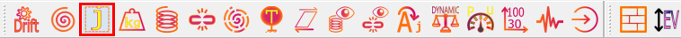
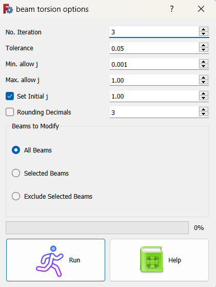
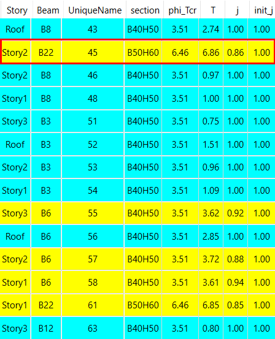

##  محاسبه ضریب ترک خوردگی پیچشی تیرها

::: {.panel-tabset}

### نرم افزار 
نرم افزار 
**civiltools**
قادر است این بند از آیین نامه را برای تیر ها چک کرده و پیچش تیر ها را بااعمال ضریب پیچشی به آن ها تا حد
**$\phi T_{cr}$**
کاهش دهد.
برای اعمال و انجام این کار در نرم افزار 
 **civiltools**
مطابق روش زیر باید عمل کنیم:

**1-**ابتدا روی آیکن زیر در نرم افزار کلیک کنید.

**2-**در پنجره بازشده با انجام تنظمیات خواسته شده وزدن دکمه
**Run**
نرم افزار به اعمال ضریب ترک خوردگی پیچشی می پردازد

<!-- 
 -->
**No.Iteration:**
تعداد سعی و خطاهایی که نرم افزار انجام می دهد تا مقدار
**$T_u$** 
رابه
**$\phi T_{cr}$**
برساند.

::: {.callout-tip}

بدیهی است که هرچقدر این عدد بیشترباشدمدت زمان فرآیند تخصیص ضریب ترک خوردگی پیچشی به تیرها بیشتر می شود.
:::

<!-- 
 -->
**telorance:**
اگردرصد اختلاف  مقادیر 
**$T_u$**
و
**$\phi T_{cr}$**
برای تمامی تیرها از مقدار مشخص شده در
**telorance**
 کمتر بودروند سعی و خطا متوقف میشود.

::: {.callout-tip}

در نهایت ممکن است مقادیر
**$T_u$** 
برخی از تیرها به مقدار درصد مشخص شده در 
**telorance**
کمتر از 
**$\phi T_{cr}$**
باشد، چون نرم افزار به تعداد سعی و خطای مشخص شده توسط کاربر رسیده است.

:::

<!-- 
 -->
**Min allow j: وMax allow j:**
حداقل و حداکثر مقادیر ضریب پیچشی که برنامه اجازه دارد به تیر ها اختصاص دهد.درواقع همواره مقدار ضریب پیچشی تیر ها بین این دومقدار که توسط کاربر انتخاب می شود خواهد بود.

<!-- 
 -->
**set initial j:**
باز زدن تیک این گزینه نرم افزار ضریب سختی پیچشی همه تیرهارا برابر با عدد وارد شده کاربر قرار داده وسپس محاسبات خودرابرای تعیین ضریب پیچشی انجام می دهد.

<!-- 
 -->
**Rounding Demicals:**
کاربر مشخص میکند که ضریب 
**j**
تا چند رقم اعشار گرد شود.

<!-- ::: {.panel-tabset} -->

#### beams  to modify

<!-- 
 -->
**All beams:**
محاسبه ضریب
**j**
برای کلیه تیر ها انجام می گیرد.

<!-- 
 -->
**selected beams:**
محاسبه ضریب
**j**
.برای تیرهای انتخاب شده انجام می گیرد

<!-- 
 -->
**exclude selected beams:**
محاسبه ضریب
**j**
برای همه تیر ها به جز تیرهای انتخاب شده انجام می گیرد.

در انتها با زدن دکمه 
**Run**
روند اعمال ضریب 
**j**
 شروع شده و پس ازاتمام پروسه  نتایج به صورت جدول نمایش داده می شود.
 با کلیک بر روی هر سطر، تیر مورد نظر در مدل ایتبز در حالت انتخاب قرار میگیرد.
 

سطرهای زرد رنگ به معنی تغییر ضریب j و سطرهای آبی رنگ به معنی عدم تغییر ضریب j است. 

برای مثال برای تیر 
**B22**
که در طبقه دوم قراردارد ضریب 
**j**
از **1**
به
**0.86**
تغییر یافته است. 

:::

